```mermaid
%%{
  init: {
    "themeCSS": ".node rect { fill: #fdb; stroke: #000; } .nodeLabel { color: #000; } div { text-align: left; line-height: 1.2; } pre { margin: 16px 0 0 0; }"
  }
}%%
flowchart LR

A("<b>chunk-?.js</b><br>hash: 🍎<pre>
console.log('foo');
import('<span style=color:red>./bar.js</span>');</pre>")
B("<b>chunk-?.js</b><br>hash: 🥦<pre>
console.log('bar');
import('<span style=color:red>./foo.js</span>');</pre>")
A --> B
B --> A
```

```mermaid
%%{
  init: {
    "themeCSS": ".node rect { fill: #fdb; stroke: #000; } .nodeLabel { color: #000; } div { text-align: left; line-height: 1.2; } pre { margin: 16px 0 0 0; }"
  }
}%%
flowchart LR

A("<b>chunk-🐠.js</b><br>hash: 🍎<br>depends on: 🍎 + 🥦 = 🐠<pre>
console.log('foo');
import('<span style=color:red>./bar.js</span>');</pre>")
B("<b>chunk-🦑.js</b><br>hash: 🥦<br>depends on: 🥦 + 🍎 = 🦑<pre>
console.log('bar');
import('<span style=color:red>./foo.js</span>');</pre>")
A --> B
B --> A
```

```mermaid
%%{
  init: {
    "themeCSS": ".node rect { fill: #fdb; stroke: #000; } .nodeLabel { color: #000; } div { text-align: left; line-height: 1.2; } pre { margin: 16px 0 0 0; }"
  }
}%%
flowchart LR

A("<b>chunk-🐠.js</b><br>hash: 🍎<br>depends on: 🍎 + 🥦 = 🐠<pre>
console.log('foo');
import('<span style=color:blue>./chunk-🦑.js</span>');</pre>")
B("<b>chunk-🦑.js</b><br>hash: 🥦<br>depends on: 🥦 + 🍎 = 🦑 <pre>
console.log('bar');
import('<span style=color:blue>./chunk-🐠.js</span>');</pre>")
A --> B
B --> A
```

```mermaid
%%{
  init: {
    "themeCSS": ".node rect { fill: #fdb; stroke: #000; } .nodeLabel { color: #000; } div { text-align: left; line-height: 1.2; } pre { margin: 16px 0 0 0; }"
  }
}%%
flowchart LR

A("<b>chunk-🐠.js</b><br>hash: 🍎<br>depends on: 🍎 + 🥦 = 🐠<pre>
console.log('foo');
import('<span style=color:blue>./chunk-🦑.js</span>');</pre>")
B("<b>chunk-🦑.js</b><br>hash: 🥦<br>depends on: 🥦 + 🍎 = 🦑<pre>
console.log('<span style=color:red>transformed</span>');
import('<span style=color:blue>./chunk-🐠.js</span>');</pre>")
A --> B
B --> A
```

```mermaid
%%{
  init: {
    "themeCSS": ".node rect { fill: #fdb; stroke: #000; } .nodeLabel { color: #000; } div { text-align: left; line-height: 1.2; } pre { margin: 16px 0 0 0; }"
  }
}%%
flowchart LR

A("<b>chunk-<span style=color:blue>~!{1}~</span>.js</b><br>hash: 🍎<br>depends on: <span style=color:blue>~!{1}~</span>, <span style=color:blue>~!{2}~</span><pre>
console.log('foo');
import('./chunk-<span style=color:red>~!{0}~</span>.js');</pre>")
B("<b>chunk-<span style=color:blue>~!{2}~</span>.js</b><br>hash: 🫐<br>depends on: <span style=color:blue>~!{2}~</span>, <span style=color:blue>~!{1}~</span><pre>
console.log('<span style=color:red>transformed</span>');
import('./chunk-<span style=color:red>~!{0}~</span>.js');</pre>")
A --> B
B --> A
```

```mermaid
%%{
  init: {
    "themeCSS": ".node rect { fill: #fdb; stroke: #000; } .nodeLabel { color: #000; } div { text-align: left; line-height: 1.2; } pre { margin: 16px 0 0 0; }"
  }
}%%
flowchart LR

A("<b>chunk-🍐.js</b><br>hash: 🍎<br>depends on: 🍎 + 🫐 = 🍐<pre>
console.log('foo');
import('./chunk-🍊.js');</pre>")
B("<b>chunk-🍊.js</b><br>hash: 🫐<br>depends on: 🫐 + 🍎 = 🍊<pre>
console.log('<span style=color:red>transformed</span>');
import('./chunk-🍐.js');</pre>")
A --> B
B --> A
```

# The hashing dilemma,<br>Rollup 3,<br>and our future with Vite

Dr. Lukas Taegert-Atkinson<br>
TNG Technology Consulting

Maintainer of RollupJS

---
layout: tweet-right
tweet: '1563159067979161601'
---

# Will talk about Vite/Rollup cooperation later

but first…

---
layout: cover
background: https://source.unsplash.com/collection/94734566/1920x1080
---

# An ancient Rollup bug

---
class: 'grid justify-center'
---


---
layout: tweet-right
tweet: '1277937776898519040'
---

# Uh oh

---

# Unique file names based on content


---
clicks: 2
---

# Unique file names based on content


<div class="click-fade" v-click="1">
<div v-click="1">

- long-term client-side caching

</div>
<div v-click="2">

- deployments at any time<br>
  → take unchanged files from cache

</div>
</div>

---

# Problem: Circular references

Content of each chunk depends on the hash of the other chunk.

<div style="height: 160px">


</div>

<div class="click-fade" v-click="1">
<div v-click="1">

1. Per-file hashes that do not include other hashes<br>
   → Rollup 2: Hash with original file name

</div>
<div v-click="2">

2. Combine "hash dependencies" to final hash

</div>
<div v-click="2">

3. Replace hashes<br>
   → Rollup 2: Replace imports with chunk names
</div>
</div>

---

# Problem: Circular references

Content of each chunk depends on the hash of the other chunk.

<div style="height: 160px">



</div>

1. Per-file hashes that do not include other hashes<br>
   → Rollup 2: Hash with original file name

---

# Problem: Circular references

Content of each chunk depends on the hash of the other chunk.

<div style="height: 160px">



</div>

1. Per-file hashes that do not include other hashes<br>
   → Rollup 2: Hash with original file name
2. Combine "hash dependencies" to final hash

---

# Problem: Circular references

Content of each chunk depends on the hash of the other chunk.

<div style="height: 160px">



</div>

1. Per-file hashes that do not include other hashes<br>
   → Rollup 2: Hash with original file name
2. Combine "hash dependencies" to final hash
3. Replace hashes<br>
   → Rollup 2: Replace imports with chunk names

---

# Problem: Circular references

Content of each chunk depends on the hash of the other chunk.

<div style="height: 160px">



</div>

1. Per-file hashes that do not include other hashes<br>
   → Rollup 2: Hash with original file name
2. Combine "hash dependencies" to final hash
3. Replace hashes<br>
   → Rollup 2: Replace imports with chunk names
4. 🚨 Run `renderChunk` plugin hook for chunk transformations

---

## Nice
easy to implement, handles cycles

<v-click>

## Oops
hashes depend on original file names

</v-click>
<v-click>


## Arrgh
**chunk transformations by plugins after hashing cannot change hashes**

→ Rollup's `renderChunk` hook breaks content hashing

</v-click>

---
class: 'grid justify-center content-start'
---

# Not nice on tooling.report


---

# Rollup 3

<div style="height: 160px">


</div>

1. Replace hashes with placeholders

---

# Rollup 3

<div style="height: 160px">


</div>

1. Replace hashes with placeholders
2. Transform chunk via `renderChunk`

---

# Rollup 3

<div style="height: 160px">


</div>

1. Replace hashes with placeholders
2. Transform chunk via `renderChunk`
3. Search placeholders in output to get hash dependencies

---

# Rollup 3

<div style="height: 160px">



</div>

1. Replace hashes with placeholders
2. Transform chunk via `renderChunk`
3. Search placeholders in output to get hash dependencies
4. Replace placeholders with default for content hash

---

# Rollup 3

<div style="height: 160px">



</div>

1. Replace hashes with placeholders
2. Transform chunk via `renderChunk`
3. Search placeholders in output to get hash dependencies
4. Replace placeholders with default for content hash
5. Replace placeholders with final hashes

---

## Yes
stable hashes that only depend on content

<v-click>

## Cool
arbitrary file transformations in `renderChunk` possible

</v-click>
<v-click>

## Wow
any chunk reference can be added in `renderChunk`

```js
function renderChunk(code, chunk, outputOptions, { /* NEW */ chunks }){
    // ...
}
```

</v-click>

---
layout: tweet-right
tweet: '1565292648134578177'
---

# Makes Vite<br>happy


---
layout: tweet-right
tweet: '1552627938046222336'
---

# How does Rollup<br>feel about<br>Vite?

<v-click>

Using Rollup was a unilateral choice

</v-click>

---
layout: image-right
---

# Why did Vite choose Rollup?

(to my understanding)

1. Solve the plugin dilemma:<br>No plugins without users, no users without plugins
2. Slightly smaller output than other options
3. More mature code-splitting options and configurability than esbuild

Which is exactly what we hope Rollup provides to higher level tooling!

---

# A personal detour

- Rich Harris created Rollup in 2015
- In 2017, I created some PRs to improve tree-shaking
- Accidentally became Rollup maintainer<br>

---
layout: small-image-right
image: https://source.unsplash.com/collection/94734566/1920x1080
---

# A strategic decision

Problem: No large team, mostly single-time contributors

Double down on:
- __Core improvements__: Do not expand Rollup's scope lightly
- __Configurability__: Few assumptions about what Rollup is used for
- __Do not expose internals__: Allow easy refactoring
- __Plugin interface__ as first-class API

→ Hope for higher-level tooling for better DX in specific use cases:

- TSDX, microbundle (library bundling)
- Stencil (web components)

But Vite was beyond my wildest hopes!

---

# Creating a partnership

- Include Vite and WMR developers early in plugin API extensions
- Consider moving Vite plugin API extensions upstream<br>
  → "order" attribute for plugin hooks (as a better "enforce")

  __People should be able to write Rollup plugins instead of Vite plugins<br>unless they really need Vite features__

---

# Going forward

More Rollup 3 features that benefit Vite users

- per-chunk `banner/footer/intro/outro` config for simple code injection<br>
  → make sure to update chunk info when changing imports/exports
- refined errors
- sourcemaps as regular assets in `generateBundle`
- better alignment with NodeJS interop for library bundling<br>
  → improved defaults for `interop`, `esModule`
- improved defaults for `preserveEntrySignatures`, `generatedCode`,<br>`makeAbsoluteExternalsRelative`
- smaller footprint via separate browser build

---

# Roadmap

From Vite docs:

> … That said, we won't rule out the possibility of using esbuild for production builds when it stabilizes these features in the future.

Focus on our strengths
* tree-shaking/code optimization
* code-splitting<br>next up: Minimum chunk size target, merge small side effect free chunks into larger ones

Performance: Do not rule out converting parts to native code eventually

* Probably Rust rather than Go, build on SWC
* Need new contributors to pull this off

