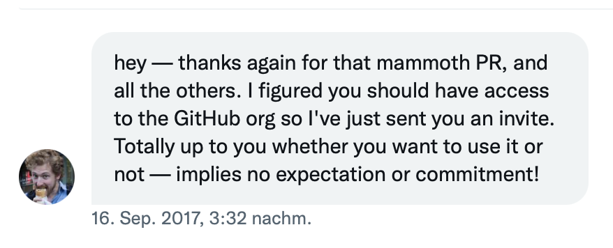

```mermaid
%%{
  init: {
    "themeCSS": ".node rect { fill: #fdb; stroke: #000; } .nodeLabel { color: #000; } .node div { text-align: left; line-height: 1.2; padding: 8px; } pre { margin: 16px 0 0 0; }"
  }
}%%
flowchart LR

A("<b>chunk-?.js</b><br>hash: 🍎<pre>
console.log('foo');
import('<span style=color:red>./bar.js</span>');</pre>")
B("<b>chunk-?.js</b><br>hash: 🥦<pre>
console.log('bar');
import('<span style=color:red>./foo.js</span>');</pre>")
A --> B
B --> A
```

```mermaid
%%{
  init: {
    "themeCSS": ".node rect { fill: #fdb; stroke: #000; } .nodeLabel { color: #000; } .node div { text-align: left; line-height: 1.2; padding: 8px; } pre { margin: 16px 0 0 0; }"
  }
}%%
flowchart LR

A("<b>chunk-🐠.js</b><br>hash: 🍎<br>depends on: 🍎 + 🥦 = 🐠<pre>
console.log('foo');
import('<span style=color:red>./bar.js</span>');</pre>")
B("<b>chunk-🦑.js</b><br>hash: 🥦<br>depends on: 🥦 + 🍎 = 🦑<pre>
console.log('bar');
import('<span style=color:red>./foo.js</span>');</pre>")
A --> B
B --> A
```

```mermaid
%%{
  init: {
    "themeCSS": ".node rect { fill: #fdb; stroke: #000; } .nodeLabel { color: #000; } .node div { text-align: left; line-height: 1.2; padding: 8px; } pre { margin: 16px 0 0 0; }"
  }
}%%
flowchart LR

A("<b>chunk-🐠.js</b><br>hash: 🍎<br>depends on: 🍎 + 🥦 = 🐠<pre>
console.log('foo');
import('<span style=color:blue>./chunk-🦑.js</span>');</pre>")
B("<b>chunk-🦑.js</b><br>hash: 🥦<br>depends on: 🥦 + 🍎 = 🦑 <pre>
console.log('bar');
import('<span style=color:blue>./chunk-🐠.js</span>');</pre>")
A --> B
B --> A
```

```mermaid
%%{
  init: {
    "themeCSS": ".node rect { fill: #fdb; stroke: #000; } .nodeLabel { color: #000; } .node div { text-align: left; line-height: 1.2; padding: 8px; } pre { margin: 16px 0 0 0; }"
  }
}%%
flowchart LR

A("<b>chunk-🐠.js</b><br>hash: 🍎<br>depends on: 🍎 + 🥦 = 🐠<pre>
console.log('foo');
import('<span style=color:blue>./chunk-🦑.js</span>');</pre>")
B("<b>chunk-🦑.js</b><br>hash: 🥦<br>depends on: 🥦 + 🍎 = 🦑<pre>
console.log('<span style=color:red>changed</span>');
import('<span style=color:blue>./chunk-🐠.js</span>');</pre>")
A --> B
B --> A
```

```mermaid
%%{
  init: {
    "themeCSS": ".node rect { fill: #fdb; stroke: #000; } .nodeLabel { color: #000; } .node div { text-align: left; line-height: 1.2; padding: 8px; } pre { margin: 16px 0 0 0; }"
  }
}%%
flowchart LR

A("<b>chunk-<span style=color:blue>~!{1}~</span>.js</b><br>hash: 🍎<br>depends on: <span style=color:blue>~!{1}~</span>, <span style=color:blue>~!{2}~</span><pre>
console.log('foo');
import('./chunk-<span style=color:red>~!{0}~</span>.js');</pre>")
B("<b>chunk-<span style=color:blue>~!{2}~</span>.js</b><br>hash: 🫐<br>depends on: <span style=color:blue>~!{2}~</span>, <span style=color:blue>~!{1}~</span><pre>
console.log('<span style=color:red>changed</span>');
import('./chunk-<span style=color:red>~!{0}~</span>.js');</pre>")
A --> B
B --> A
```

```mermaid
%%{
  init: {
    "themeCSS": ".node rect { fill: #fdb; stroke: #000; } .nodeLabel { color: #000; } .node div { text-align: left; line-height: 1.2; padding: 8px; } pre { margin: 16px 0 0 0; }"
  }
}%%
flowchart LR

A("<b>chunk-🍐.js</b><br>hash: 🍎<br>depends on: 🍎 + 🫐 = 🍐<pre>
console.log('foo');
import('./chunk-🍊.js');</pre>")
B("<b>chunk-🍊.js</b><br>hash: 🫐<br>depends on: 🫐 + 🍎 = 🍊<pre>
console.log('<span style=color:red>changed</span>');
import('./chunk-🍐.js');</pre>")
A --> B
B --> A
```

# The hashing dilemma,<br>Rollup 3,<br>and our future with Vite

Dr. Lukas Taegert-Atkinson<br>
TNG Technology Consulting

Maintainer of RollupJS

---
layout: tweet-right
tweet: '1563159067979161601'
---

<div v-click>

# Will talk about Vite/Rollup cooperation later

but first…

</div>

---
layout: cover
background: images/ancient-bug.jpeg
---

# An ancient Rollup bug

---
class: 'grid justify-center'
---


---
layout: tweet-right
tweet: '1277937776898519040'
---

<div v-click>

# Uh oh

</div>

---
layout: small-image-right
image: images/ancient-bug.jpeg
---

# Content-based file names


---
clicks: 2
layout: small-image-right
image: images/ancient-bug.jpeg
---

# Content-based file names


<div class="click-fade" v-click="1">
<div v-click="1">

- long-term client-side caching

</div>
<div v-click="2">

- deployments at any time<br>
  → take unchanged files from cache

</div>
</div>

---
clicks: 1
layout: small-image-right
image: images/ancient-bug.jpeg
---

# Problem: Circular references

<div style="height: 170px">


</div>

<div class="click-fade" v-click="1">
<div v-click="1">

1. Start with per-file hashes that do not include other hashes<br>
   <span v-click="2">→ Rollup 2: Hash with original import targets</span>

</div>
<div v-click="2">

2. Combine "hash dependencies" to final hash
3. Replace hashes<br>
   → Rollup 2: Replace imports with chunk names

</div>
</div>

---
clicks: 0
layout: small-image-right
image: images/ancient-bug.jpeg
---

# Problem: Circular references

<div style="height: 170px">



</div>

<div class="click-fade">

1. Start with per-file hashes that do not include other hashes<br>
   → Rollup 2: Hash with original import targets

<div v-click="1">

2. Combine "hash dependencies" to final hash
3. Replace hashes<br>
   → Rollup 2: Replace imports with chunk names

</div>
</div>

---
clicks: 0
layout: small-image-right
image: images/ancient-bug.jpeg
---

# Problem: Circular references

<div style="height: 170px">



</div>


<div class="click-fade">
<div v-click="-1">

1. Start with per-file hashes that do not include other hashes<br>
   → Rollup 2: Hash with original import targets

</div>

2. Combine "hash dependencies" to final hash

<div v-click="1">

3. Replace hashes<br>
   → Rollup 2: Replace imports with chunk names

</div>
</div>

---
clicks: 0
layout: small-image-right
image: images/ancient-bug.jpeg
---

# Problem: Circular references

<div style="height: 170px">



</div>

<div class="click-fade">
<div v-click="-1">

1. Start with per-file hashes that do not include other hashes<br>
   → Rollup 2: Hash with original import targets
2. Combine "hash dependencies" to final hash

</div>

3. Replace hashes<br>
   → Rollup 2: Replace imports with chunk names

</div>

---
layout: small-image-right
image: images/ancient-bug.jpeg
---

# Problem: Circular references

<div style="height: 170px">



</div>


<div class="click-fade">
<div v-click="-1">

1. Start with per-file hashes that do not include other hashes<br>
   → Rollup 2: Hash with original import targets
2. Combine "hash dependencies" to final hash
3. Replace hashes<br>
   → Rollup 2: Replace imports with chunk names

</div>

4. 🚨 Run `renderChunk` plugin hook for chunk transformations

</div>

---
layout: small-image-right
image: images/ancient-bug.jpeg
---

## Nice
easy to implement, handles cycles

<v-click>

## Oops
hashes depend on original file names

</v-click>
<v-click>


## Arrgh
**chunk transformations by plugins after hashing cannot change hashes**

→ Rollup's `renderChunk` hook breaks content hashing

</v-click>

---
layout: small-image-right
image: images/ancient-bug.jpeg
---

# Not nice on tooling.report


---
layout: cover
background: images/solving-the-hashing-dilemma.jpeg
---

# Rollup 3:<br>Solving the hashing dilemma

---
clicks: 0
layout: small-image-right
image: images/solving-the-hashing-dilemma.jpeg
---

# Rollup 3 hashing

<div style="height: 170px">


</div>

---
clicks: 0
layout: small-image-right
image: images/solving-the-hashing-dilemma.jpeg
---

# Rollup 3 hashing

<div style="height: 170px">


</div>

<div class="click-fade">

1. Replace hashes with placeholders

<div v-click="1">

2. Transform chunk via `renderChunk`
3. Search placeholders in output to get hash dependencies
4. Replace placeholders with default for content hash
5. Replace placeholders with final hashes

</div>
</div>

---
clicks: 0
layout: small-image-right
image: images/solving-the-hashing-dilemma.jpeg
---

# Rollup 3 hashing

<div style="height: 170px">


</div>


<div class="click-fade">
<div v-click="-1">

1. Replace hashes with placeholders

</div>

2. Transform chunk via `renderChunk`

<div v-click="1">

3. Search placeholders in output to get hash dependencies
4. Replace placeholders with default for content hash
5. Replace placeholders with final hashes

</div>
</div>


---
clicks: 0
layout: small-image-right
image: images/solving-the-hashing-dilemma.jpeg
---

# Rollup 3 hashing

<div style="height: 170px">


</div>


<div class="click-fade">
<div v-click="-1">

1. Replace hashes with placeholders
2. Transform chunk via `renderChunk`

</div>

3. Search placeholders in output to get hash dependencies

<div v-click="1">

4. Replace placeholders with default for content hash
5. Replace placeholders with final hashes

</div>
</div>

---
clicks: 0
layout: small-image-right
image: images/solving-the-hashing-dilemma.jpeg
---

# Rollup 3 hashing

<div style="height: 170px">



</div>


<div class="click-fade">
<div v-click="-1">

1. Replace hashes with placeholders
2. Transform chunk via `renderChunk`
3. Search placeholders in output to get hash dependencies

</div>

4. Replace placeholders with default for content hash

<div v-click="1">

5. Replace placeholders with final hashes

</div>
</div>

---
clicks: 0
layout: small-image-right
image: images/solving-the-hashing-dilemma.jpeg
---

# Rollup 3 hashing

<div style="height: 170px">



</div>


<div class="click-fade">
<div v-click="-1">

1. Replace hashes with placeholders
2. Transform chunk via `renderChunk`
3. Search placeholders in output to get hash dependencies
4. Replace placeholders with default for content hash

</div>

5. Replace placeholders with final hashes

</div>

---
layout: small-image-right
image: images/solving-the-hashing-dilemma.jpeg
---

## Yes
stable hashes that only depend on content

<v-click>

## Cool
arbitrary file transformations in `renderChunk` possible

</v-click>
<v-click>

## Wow
any chunk reference can be added in `renderChunk`

```js
function renderChunk(code, chunk, outputOptions, { /* NEW */ chunks }){
    // ...
}
```

</v-click>

---
layout: tweet-right
tweet: '1565292648134578177'
---

<div v-click>

# Makes Vite<br>happy

</div>

---
layout: cover
background: images/future.jpeg
---

# A future with Vite

---
layout: tweet-right
tweet: '1552627938046222336'
tweet-click: true
clicks: 1
---

# How does Rollup<br>feel about<br>Vite?

<v-click>

We were not asked…

</v-click>

---
layout: small-image-right
image: images/future.jpeg
clicks: 3
---

# Why did Vite choose Rollup?

<div v-click="1">
<div class="click-fade">
<v-clicks>

1. Solve the plugin dilemma:<br>No plugins without users, no users without plugins
2. Slightly smaller output than other options
3. More mature code-splitting options and configurability than esbuild

</v-clicks>
</div>
</div>
<div v-click="3">

Which is exactly how we wanted to position Rollup!

</div>


---
layout: small-image-right
image: images/future.jpeg
clicks: 3
---

# A personal detour

<div v-click="1">
<div class="click-fade">
<v-clicks>

- Rich Harris created Rollup in 2015
- In 2017, I created some PRs to improve tree-shaking
- Accidentally became Rollup maintainer<br>

</v-clicks>
</div>
</div>

---
layout: small-image-right
image: images/future.jpeg
clicks: 4
---

# Strategic decisions

Problem: No large team, mostly single-time contributors

<div v-click="1">

Double down on:

<div class="click-fade">
<v-clicks>

- __Core improvements__<br>Do not expand Rollup's scope lightly
- __No exposed internals__<br>Allow easy refactoring
- __Configurability__<br>Few assumptions about what Rollup is used for
- __Plugin interface__<br>as stable, well-documented first-class API

</v-clicks>
</div>
</div>

---
layout: small-image-right
image: images/future.jpeg
---

# Encourage third-party tooling

for better DX in specific use cases

<v-clicks>

- TSDX, microbundle (library bundling)
- Stencil (web components)

But WMR and especially Vite were beyond my wildest hopes!

</v-clicks>

---
layout: small-image-right
image: images/future.jpeg
clicks: 2
---

# Creating a partnership

<div v-click="1">
<div class="click-fade">
<v-clicks>

- Include Vite and WMR developers early in plugin API extensions
- Move some Vite plugin API extensions upstream<br>
  → "order" attribute for plugin hooks (as a better "enforce")

  <div class="no-fade">
  
  __People should be able to write Rollup plugins instead of Vite plugins unless they really need to target Vite__

  </div>

</v-clicks>
</div>
</div>

---
layout: cover
background: images/roadmap.jpeg
---

# Roadmap

---
layout: small-image-right
image: images/roadmap-narrow.jpeg
clicks: 4
---

# More Rollup 3 goodies

<div class="click-fade">
<v-clicks at="0">

- per-chunk `banner/footer/intro/outro` config for simple code injection
- sourcemaps as regular assets in `generateBundle`
- better alignment with NodeJS interop for library bundling<br>
  → improved defaults for `interop`, `esModule`
- improved defaults for `preserveEntrySignatures`, `generatedCode`,<br>`makeAbsoluteExternalsRelative`
- smaller footprint via separate browser build<br>and more…

</v-clicks>
</div>

---
layout: small-image-right
image: images/roadmap-narrow.jpeg
---

# What is next?

<div class="click-fade">

→ Focus on our strengths

<v-clicks>

- tree-shaking/code optimization
- code-splitting<br>→ next up: Minimum chunk size target,<br>merge small side effect free chunks into larger ones

</v-clicks>
</div>

---
layout: small-image-right
image: images/roadmap-narrow.jpeg
---

# What about build speed?

From Vite docs:

> … That said, we won't rule out the possibility of using esbuild for production builds when it stabilizes these features in the future.

Would consider converting parts to native code eventually

* Probably Rust rather than Go, build on SWC
* Need new contributors to pull this off
